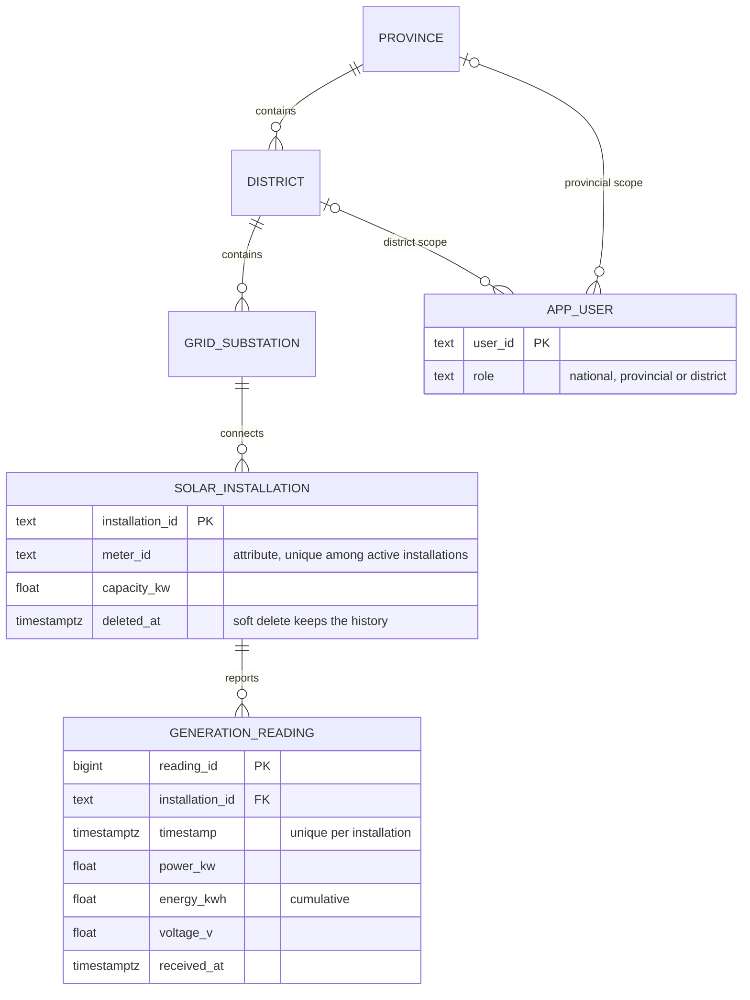

# SLSEA Real-Time Solar Generation Data API

Backend REST API for the NB6007CEM Web API Development coursework (NIBM, BSc (Hons) Computing, Coventry University). It serves real-time and historical solar-generation data for the Sri Lanka Sustainable Energy Authority (SLSEA) case study.

> **Synthetic data.** Provinces and districts are Sri Lanka's real administrative areas (ISO 3166-2:LK codes). Every grid substation, installation, meter, user and generation reading is **generated test data**. None of it is real SLSEA or CEB data or measurements.

**Author:** Savishka Kuruppu · **Maturity target:** Richardson Maturity Model Level 2 (Level 3 hypermedia is out of scope)

## Live deployment

| | URL |
|---|---|
| Live API | https://solar-generation-api.vercel.app |
| Swagger UI | https://solar-generation-api.vercel.app/docs |
| OpenAPI spec (JSON) | https://solar-generation-api.vercel.app/openapi.json |
| Health check | https://solar-generation-api.vercel.app/health |
| Repository | https://github.com/Savish18K/NB6007CEM-Solar-Generation-API |

The API runs on Vercel in Singapore (`sin1`) with a Neon PostgreSQL database in AWS Asia Pacific (Singapore). It is served over HTTPS only; plain HTTP requests are redirected with `308`. `GET /health` returns `{"status":"ok","database":"ok"}` when the API and its database are both up.

## Try it

Every endpoint except `/`, `/health`, `/docs` and `/openapi.json` needs a bearer token. In Swagger UI:

1. Open https://solar-generation-api.vercel.app/docs and click **Authorize**. Under **basicAuth**, enter one of the identifiers below with its secret.
2. Run **POST /tokens** (Try it out → Execute) and copy the `access_token` from the response.
3. Click **Authorize** again and paste the token under **bearerAuth**. Every request now carries it. Tokens last 30 minutes.

| Account | Identifier | Scope | Can access |
|---|---|---|---|
| National analyst | `national.analyst` | `analyst-read-national` | Read everything |
| Provincial analyst | `western.analyst`, `central.analyst` | `analyst-read-by-province` | Read Western (`lk-1`) or Central (`lk-2`) only |
| District analyst | `colombo.analyst`, `kandy.analyst` | `analyst-read-by-district` | Read Colombo (`lk-11`) or Kandy (`lk-21`) only |
| Metering device | `SLM-100001` (meter of installation `si-0001`) | `installation-write` | Post readings for `si-0001` only |
| Back-office admin | `backoffice` | `installation-admin` | Register, replace and delete installations; no readings |

The passwords and device secrets are not stored in this repository. They are supplied with the coursework submission.

## Seed data

The deployment is seeded at the scale the brief asks for, with foreign keys consistent throughout:

| Element | Seeded | Notes |
|---|---|---|
| Provinces | 9 | Real names and ISO 3166-2:LK codes (`lk-1` … `lk-9`) |
| Districts | 25 | Real names and codes (`lk-11` … `lk-92`) |
| Grid substations | 30 | `gs-001` … `gs-030`; five districts have two |
| Solar installations | 250 | `si-0001` … `si-0250`; 3–50 kW; each has a `meter_id` (`SLM-100001` …) |
| Generation readings | 8 days per installation, every 15 minutes | About 192,000 rows. They follow a day/night solar curve, and new intervals are added while the API is in use |
| Users | 5 | One national, two provincial and two district analysts |

## Data model

Five entities form the geographic and asset hierarchy, plus the user. The meter identifier is an attribute of the installation (there is no separate device entity), and readings are an append-only time series. The database rejects any `UPDATE`, `DELETE` or `TRUNCATE` on them.



## Stack

| Concern | Choice | Why |
|---|---|---|
| Runtime / framework | Node.js + Express 5, TypeScript | The stack used in the module |
| Hosting | Vercel (one Node.js Vercel Function, Fluid compute, region `sin1` Singapore) | Public HTTPS URL with no server to manage; pushes to GitHub deploy automatically |
| Database | Neon serverless PostgreSQL in production; PGlite (Postgres compiled to WASM) for local development | Readings have to survive restarts, and paging and filtering happen in SQL. PGlite needs no install and runs the same SQL |
| Validation | zod | Strict request validation, mapped to the API's error format |
| Auth | JWT bearer (jose, HS256) with scopes; scrypt-hashed secrets | Bearer tokens with scopes, without running a full OAuth server |
| Docs | OpenAPI 3.1 + Swagger UI at `/docs` | Lets markers try the API in the browser |

## Resources

All resources are JSON, and all require a bearer token except `/`, `/health`, `/docs` and `/openapi.json`.

| Method | URI | Resource type | Who |
|---|---|---|---|
| POST | `/tokens` | processing (issues a JWT; 200, `no-store`) | anyone with credentials (HTTP Basic) |
| GET | `/provinces`, `/provinces/{province-id}` | collection / atomic | SLSEA users |
| GET | `/districts[?province-id=]`, `/districts/{district-id}` | collection / atomic | SLSEA users |
| GET | `/grid-substations[?province-id=&district-id=]`, `/grid-substations/{grid-substation-id}` | collection / atomic | SLSEA users |
| GET | `/installations[?province-id=&district-id=&grid-substation-id=]` | collection | SLSEA users, admin |
| POST | `/installations` | collection (factory) → 201 + Location | admin |
| GET | `/installations/{installation-id}` | **composite**: installation + nested `last_reading` | SLSEA users, admin |
| PUT / DELETE | `/installations/{installation-id}` | atomic (full replace / soft delete; history kept) | admin |
| GET | `/installations/{installation-id}/readings` | scoped history collection | SLSEA users |
| POST | `/installations/{installation-id}/readings` | ingestion → 201 + Location | that installation's meter only |
| GET | `/installations/{installation-id}/readings/{reading-id}` | atomic reading | SLSEA users |
| GET | `/installations/{installation-id}/last-known-reading` | processing function (derived) | SLSEA users |
| GET | `/provinces/{id}/readings`, `/districts/{id}/readings`, `/grid-substations/{id}/readings` | regional history collections | SLSEA users |
| GET | `/districts/{district-id}/generation-summary[?as-of=]` | processing function (aggregate) | SLSEA users |
| GET | `/users/{user-id}` | atomic (own profile only) | the user |

**History collections** support:
- `page`, `page-size` (default 50, maximum 500), with `count`, `next` and `previous` in the response;
- `from` and `to` (ISO 8601 with a UTC offset; half-open window);
- `sort=timestamp` or `sort=-timestamp` (default: newest first).

Every retrievable resource sends `ETag` and `Last-Modified`, and answers conditional GETs with `304` and an empty body.

**Errors** always have the shape `{ "code": 404001, "message": "...", "description": "...", "error": [] }`.

## Security model

- **Metering devices** authenticate as their installation (`meter_id` plus device secret). They get the `installation-write` scope and can only POST readings to their own installation. A different installation returns `403`.
- **SLSEA users** are read-only:
  - national → `analyst-read-national`;
  - provincial → `analyst-read-by-province`;
  - district → `analyst-read-by-district`.
  Jurisdiction comes from the user record in the database. Unfiltered collections are narrowed to it. An explicit request outside it returns `403`.
- **Back-office administrator** (`installation-admin`) registers, updates and deletes installations. It is not an SLSEA user and cannot read readings.
- `401` is returned for missing, invalid or expired credentials, always with `WWW-Authenticate`. `403` is returned for an identified caller who is not permitted.

## Run locally

Requires Node.js 22.12 or later. No database install is needed.

```bash
npm install
cp .env.example .env        # then edit the placeholder secrets
npm run dev                 # http://localhost:3000/docs ; seeds a local PGlite database on first start
```

Other scripts:
- `npm run typecheck`
- `npm run build && npm start`: production build.
- `npm run db:seed`: seed or top up the database named by `DATABASE_URL`.
- `npm run credentials:demo`: print the demo logins for the seeded accounts. Don't commit the output.
- `SMOKE_PASSWORD=... npm run smoke:live -- https://solar-generation-api.vercel.app`: check a live deployment and print PASS/FAIL per check. Set `SMOKE_METER` and `SMOKE_DEVICE_SECRET` as well to include the device write checks.

### Getting a token with curl

Set `BASE` to `http://localhost:3000` for a local copy, or to the live URL:

```bash
BASE=https://solar-generation-api.vercel.app
# SLSEA analyst (read)
curl -s -X POST $BASE/tokens -u national.analyst:$SEED_USER_PASSWORD
curl -s $BASE/provinces -H "Authorization: Bearer <token>"
# metering device (write): the username is the meter_id, the secret comes from `npm run credentials:demo`
curl -s -X POST $BASE/tokens -u SLM-100001:<device-secret>
curl -s -X POST $BASE/installations/si-0001/readings \
  -H "Authorization: Bearer <token>" -H "Content-Type: application/json" \
  -d '{"timestamp":"2026-09-23T10:15:00+05:30","power_kw":3.2,"energy_kwh":20100.5,"voltage_v":231.4}'
```

## Deploy (Vercel + Neon)

How the pieces fit together:

- **Neon** hosts the PostgreSQL database. The app connects with `pg` (node-postgres) over TCP, using Neon's pooled connection string.
- **Vercel** runs the whole Express app as one Vercel Function, [api/index.ts](api/index.ts). [vercel.json](vercel.json) rewrites every path to that function, so the URIs in the table above are the public URIs. Vercel serves it over HTTPS.
- The entry point default-exports an Express app, not a bare `(req, res)` function. For a bare function, Vercel adds its own request helpers, which read the body before `express.json()` can and replace `res.json`. That would break the 400005 and 413001 errors.
- Only [public/](public/) is served as static files, so the source tree is never exposed. Swagger UI's assets are bundled into the function with `includeFiles`.
- Each function instance opens its pool and checks migrations on its first request. A transaction-level advisory lock means simultaneous cold starts apply each migration only once. `attachDatabasePool` from `@vercel/functions` closes idle Neon connections before an instance is suspended.
- There is no long-running process on Vercel. The synthetic readings are topped up in the background after a response has been sent (`waitUntil`), at most every 5 minutes per instance. The seeder only adds missing 15-minute intervals.

### 1. Create the Neon database

1. At [neon.com](https://neon.com), create a project in region **AWS Asia Pacific (Singapore)**. It sits next to Vercel's `sin1` region, which is set in `vercel.json`.
2. Copy the **pooled** connection string. Its host contains `-pooler`. Change `sslmode=require` to `sslmode=verify-full`. Neon's certificate is publicly trusted, and `pg` warns about `require`.
3. Make sure the free plan's limits won't stop the database before marking ends. Neon's free plan scales to zero when idle and wakes on the next connection, which takes about a second.

### 2. Seed it from your machine

The first visitor shouldn't be the one who triggers the big seed (about 192,000 readings), so seed once from your machine:

```bash
# .env: set DATABASE_URL to the Neon string and fill in the production secrets you will give Vercel
npm run db:seed
```

This migrates the schema, then loads 9 provinces, 25 districts, 30 substations, 250 installations and 8 days of 15-minute readings. It is safe to run again. Use exactly the same `DEVICE_SECRET_SEED` and `SEED_USER_PASSWORD` that you will give Vercel, or the demo logins won't match.

### 3. Create the Vercel project

1. Push this repository to GitHub. In Vercel, choose **Add New > Project** and import the repository. `vercel.json` sets the framework preset to *Other*, the install and build commands (`npm ci`, `npm run typecheck`), the output directory (`public`), the region and the rewrite. Leave the dashboard defaults alone.
2. In **Settings > Environment Variables**, add these for Production. Add them for Preview too if you want preview deployments to work.

   | Variable | Value |
   |---|---|
   | `DATABASE_URL` | Neon pooled connection string (`sslmode=verify-full`) |
   | `JWT_SECRET` | random, at least 32 characters |
   | `ADMIN_CLIENT_SECRET` | random, at least 16 characters |
   | `DEVICE_SECRET_SEED` | the same value used for `npm run db:seed`. Never change it, or the seeded meters' secrets change |
   | `SEED_USER_PASSWORD` | the demo analyst password, the same value used for seeding |
   | `SEED_ON_START` | `true`, to keep the synthetic readings current |
   | `SEED_DAYS` | `8` |

   `NODE_ENV` is set to `production` by Vercel. In production the app refuses to start with a PGlite `DATABASE_URL`. Generate secrets with `node -e "console.log(require('crypto').randomBytes(48).toString('base64url'))"`.

   You can also connect Neon through the Vercel Marketplace integration (**Storage > Neon**) instead of pasting the string. It sets `DATABASE_URL` for you and can create a Neon branch for each preview deployment.
3. Deploy. Every later push to `main` redeploys automatically, and other branches get preview URLs.

### 4. Check it

- https://solar-generation-api.vercel.app/health should return `{"status":"ok","database":"ok"}`.
- https://solar-generation-api.vercel.app/docs should open Swagger UI.
- `SMOKE_PASSWORD=<SEED_USER_PASSWORD> npm run smoke:live -- https://solar-generation-api.vercel.app` runs the end-to-end checks.
- Function logs are under **Project > Logs** in Vercel. Each new instance logs `instance ready (...)`, and each background top-up logs `seed: ...`.

Notes and limits:

- **Rate limiting.** The `/tokens` rate limiter keeps its counters in memory, so the limit applies per function instance rather than globally. A shared store such as Redis would make it global.
- **Fresh data after idle periods.** The synthetic readings only advance while the API is receiving requests. After a quiet period, the first request starts the catch-up and a request a few seconds later sees current data.
- **Local development** still uses `npm run dev` ([src/server.ts](src/server.ts), a normal long-running server with PGlite). `vercel dev` is not needed.

## Project structure

```
api/
  index.ts       Vercel Function entry point (one instance setup, background top-up of synthetic readings)
public/          the only static files Vercel serves (robots.txt)
vercel.json      Vercel build, region, function bundling and rewrite configuration
src/
  app.ts, server.ts, config.ts   Express app factory, local long-running server, environment validation
  db/            database adapters (pg for Neon / PGlite), migrations (schema + append-only trigger), lock-protected migrate runner
  auth/          secrets (scrypt), JWT, authentication middleware, scopes, jurisdiction rules
  http/          error catalogue + handler, representations (ETag/Last-Modified/304), pagination, validation, negotiation (406/415)
  repositories/  parameterised SQL for the hierarchy, installations, readings and the district summary
  routes/        HTTP resources (tokens, hierarchy, installations + readings, summary, users, health, docs)
  seed/          real geography + synthetic dataset + deterministic solar model + idempotent append-only seeder
  cli/           migrate, seed, demo-credentials, live smoke test
```

## Academic integrity

AI assistance was used to generate and tidy up code. The prompts and AI aids are disclosed in the report's AI-disclosure appendix (Appendix A).
